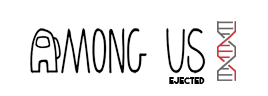

<h1 align="center">
    
</h1>

## :clipboard: About the project

A clone of the mini game that is in Among Us where the goal is to connect the wires. Come on see the [final result](https://jhonywalker-pixel.github.io/among-us-codepad/)

## :computer: Used languages

The cool thing is that this project only use HTML, CSS, SVG and Vanilla JS

## :computer: Used libraries

- [GSAP](https://cdnjs.com/libraries/gsap)

## :floppy_disk: Other related

- [Animation of ejecting](https://jhonywalker-pixel.github.io/among-us-ejected/)

- [Codepad](https://jhonywalker-pixel.github.io/among-us-codepad/)

## :book: License

This project is under the MIT license. See the [LICENSE](LICENSE.md) for more details.
